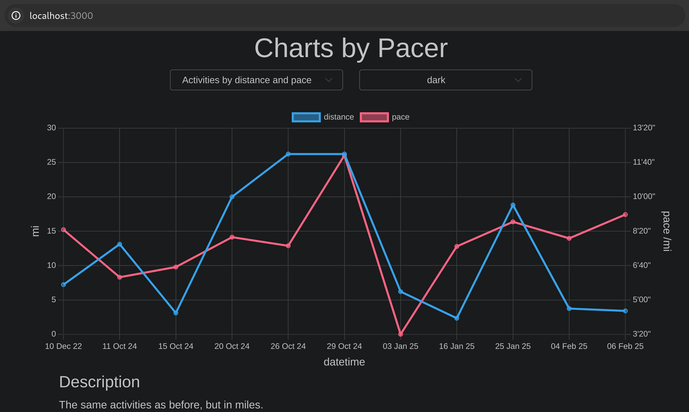

<div align="center">

# Pacer

[](https://github.com/tbidne/pacer/releases/)
[](https://github.com/tbidne/pacer/actions/workflows/ci.yaml)
[](https://opensource.org/licenses/MIT)


</div>

---

### Table of Contents
- [Introduction](#introduction)
- [Commands](#commands)
  - [Chart](#chart)
  - [Convert](#convert)
  - [Derive](#derive)
  - [Scale](#scale)
- [Installation](#installation)
- [Building](#building)
  - [Frontend](#frontend)
  - [Backend](#backend)
    - [Cabal](#cabal)
    - [Stack](#stack)
    - [Nix](#nix)
- [FAQ](#faq)

# Introduction

Pacer is a CLI application for runners. Pacer offers roughly two different services:

1. Taking running data and generating graphical charts e.g. plotting runs by distance.

2. Performing convenient calculations (e.g. deriving pace from a distance and duration).

# Commands

## Chart

The `chart` command generates graphical chart data and runs a web server that displays this data in the browser, by default on `localhost:3000`.

Charts are generated from two inputs:

- An `activities` file(s) (`json` or garmin `csv`), containing a list of all activities the user may want to chart. Multiple files will be combined.
- A `chart-requests.json` file, that determines how to construct the chart(s). The html page will contain a chart for each request in the file.

### Examples

Building the example here i.e.

```
$ pacer chart --data examples/
```

will run a server displaying several charts like this one:



See the `examples/` directory and the [faq](documentation/faq.md) for more information.

## Convert

The `convert` command converts quantities to different units.

### Examples

```
$ pacer convert --distance 5km --unit mi
3.11 mi

$ pacer convert --pace '5m20s /mi' --unit km
3'19" /km
```

> [!WARNING]
>
> With convert, pace __must__ include units i.e. either `/km` or `/mi`. Furthermore, pace cannot be given in meters nor converted to meters; only kilometers and miles are allowed.

## Derive

The `derive` command derives a third quantity from two others.

### Examples

```
# derives the pace from distance and duration
$ pacer derive --distance marathon --duration 3h15m
4'37" /km

# reverse of the above (slight difference due to rounding)
$ pacer derive --distance marathon --pace 4m37s
3h 14'48"

# we can also convert the final result to a different unit
$ pacer derive --distance marathon --duration 3h15m -u mi
7'26" /mi

$ pacer derive --pace '5m45s /mi' --duration 20m
3.48 mi
```

> [!NOTE]
>
> Built-in values like `marathon` assume unit `kilometers`, if nothing else is given.

## Scale

The `scale` command is used for scaling a single quantity.

### Examples

```
$ pacer scale --distance marathon -k 0.5
21.10 km

# we can convert the final result
$ pacer scale --distance marathon -k 0.5 -u miles
13.11 mi

$ pacer scale --pace '4m15s /km' -k 1.1
4'40" /km

# pace units are optional
$ pacer scale --pace 4m15s -k 1.1
4'40"
```

> [!WARNING]
>
> With scale, pace __must__ include units if the final result is converted.

```
$ pacer scale --pace '4m15s' -k 1.1 -u mi
Scaling pace with --unit requires that the original units are given e.g. --pace '4m15s /km'.
```

# Installation

The [releases](https://github.com/tbidne/pacer/releases) page has binaries built for several platforms. If there are no binaries for your platform, it is possible to [build pacer](#building) yourself.

# Building

## Frontend

### Prerequisites

* [`nodejs 22+`](https://nodejs.org/en/download)

### Building

Once you have `nodejs`, the frontend can be built from the `web/` directory:

```
# Change to the web directory
$ cd web

# Install nodejs dependencies
$ npm install --save

# Build frontend
$ npm run build
```

## Backend

If you have never built a haskell program before, [`cabal`](#cabal) is probably the best choice.

> [!WARNING]
>
> With the exception of [`nix`](#nix), building the backend requires that the [`frontend`](#frontend) is built first.

### Cabal

#### Prerequisites

* [`frontend`](#frontend)
* [`cabal 2.4+`](https://www.haskell.org/cabal/download.html)
* [`ghc 9.10 - 9.12`](https://gitlab.haskell.org/ghc/ghc/-/wikis/GHC%20Status)

The easiest way to install these is generally [`ghcup`](https://www.haskell.org/ghcup/).

The current "blessed" version is `ghc-9.12.2`.

#### Build Pacer

Once you have `cabal` and `ghc`, `pacer` can be built locally with `cabal build` or installed globally (e.g. `~/.local/bin/pacer`) with `cabal install`.

> [!IMPORTANT]
>
> Pacer requires git information to be available at build time, for the purposes of including some data in the binary (e.g. commit hash). Cabal's vanilla install method interfers with this, though we have a workaround that relies on passing the current directory as an environment variable:
>
> ```sh
> $ export PACER_HOME=$(pwd); cabal install exe:pacer
> ```
>
> Nix does not require such a workaround, and stack does not seem to require it either.

For further reproducibility, an optional freeze file can be used for the "blessed" compiler.

```sh
cabal build --project-file cabal.ghc<XYZ>.project
```

### Stack

#### Prerequisites

* [`frontend`](#frontend)
* [`stack`](https://docs.haskellstack.org/en/stable/)

Like `cabal` and `ghc`, `stack` can be installed with [`ghcup`](https://www.haskell.org/ghcup/).

#### Build Pacer

Once you have `stack`, `pacer` can be built with `stack build` or installed globally (i.e. `~/.local/bin/pacer`) with `stack install`.

### Nix

#### Prerequisites

* [nix](https://nixos.org/download.html)

### Manually

Building with `nix` uses [flakes](https://nixos.wiki/wiki/Flakes). `pacer` can be built with `nix build`, which will compile and run the tests.

> [!TIP]
>
> Nix will automatically build the [frontend](#frontend), so there is no need to manually invoke `nodejs`.

### Nix expression

Because `pacer` is a flake, it can be built as part of a nix expression. For instance, if you want to add `pacer` to `NixOS`, your `flake.nix` should have:

```nix
# flake.nix
{
  inputs.pacer.url = "github:tbidne/pacer/main";
}
```

Then include this in the `systemPackages`:

```nix
# wherever your global packages are defined
{
  environment.systemPackages = [
    pacer.packages."${system}".default
  ];
}
```

# FAQ

See the [faq](documentation/faq.md).
